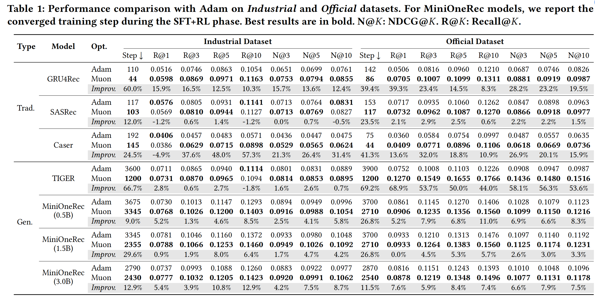

<div align="center">


# Shifting the Optimizer Paradigm Beyond Adam in Scalable Generative Recommendation


<a href="https://arxiv.org/abs/2603.00416"></a>

</div>

<div style="text-align: justify;">

**MuonRec** is the first framework that brings the recently proposed **Muon optimizer** to RecSys training. While modern RecSys pipelines almost universally default to Adam/AdamW, MuonRec performs orthogonalized momentum updates for 2D weight matrices via Newton-Schulz iteration, promoting diverse update directions and significantly improving optimization efficiency. 

This repository provides an open-sourced training recipe for both sequential and generative recommendation models, demonstrating that Muon consistently enables more efficient training and leads to superior final performance compared to Adam.

</div>

## 📊 Paper Results

### Training Efficiency and Effectiveness
<div style="text-align: justify;">

MuonRec consistently accelerates convergence for both traditional and generative recommenders, yielding an average reduction of **32.4%** in training steps across tested scenarios, while improving NDCG@10 by **12.6%** on average. 

</div>

<div align="center">
  
</div>


## 🚀 Full Pipeline 

### 0. Prerequisites
* **GPUs**: 4–8 × A100 80 GB (or comparable for large models).
* **Python**: 3.11+

### 1. Environment Setup
```bash
pip install -r requirements.txt
```

### 2. Data Preparation
**🛠️Option A: Quickstart with Provided Data**

You can skip data processing by directly using the pre-built `index.json`, `item.json`, and `.csv` files provided in `minionerec_engine/data/Amazon/`.

**🛠️Option B: Build from Scratch**

**2.1 Download the raw dataset (Optional)** 
Get it from the official page:
[Amazon Reviews 2023](https://amazon-reviews-2023.github.io/),
[Amazon Reviews 2018](https://cseweb.ucsd.edu/~jmcauley/datasets/amazon_v2/),
[Amazon Reviews 2014](https://cseweb.ucsd.edu/~jmcauley/datasets/amazon/links.html).

*Note: The Industrial and Office datasets are included in Amazon 2018; the Amazon 2014 and 2023 versions require slight modifications to our `data/amazon18_data_process.py`.*

**2.2 Filter and preprocess**
```bash
bash minionerec_engine/data/amazon18_data_process.sh \
     --dataset Industrial_and_Scientific \
     --user_k 5 \
     --item_k 5 \
     --st_year 2017 \
     --st_month 10 \
     --ed_year 2018 \
     --ed_month 11 \
     --output_path ./minionerec_engine/data/Amazon
```

**2.3 Encode item text to embeddings**
```bash
bash minionerec_engine/rq/text2emb/amazon_text2emb.sh \
     --dataset Industrial_and_Scientific \
     --root ./minionerec_engine/data/Amazon \
     --plm_name qwen \
     --plm_checkpoint your_emb_model_path
```

### 3. SID Construction
Choose either RQ-VAE or RQ-Kmeans to build your Semantic IDs.

**3.1 Train RQ-VAE on the embeddings**

```bash
bash minionerec_engine/rq/rqvae.sh
```

**3.2 Train RQ-Kmeans on the embeddings**

```bash
python minionerec_engine/rq/rqkmeans_faiss.py --dataset Industrial_and_Scientific
```

**3.3 Generate indices**

```bash
python minionerec_engine/rq/generate_indices.py --dataset Industrial_and_Scientific
```

**3.4 Convert dataset format to ReRe/MuonRec standard**

```bash
python minionerec_engine/convert_dataset.py \
     --dataset_name Industrial_and_Scientific \
     --data_dir ./minionerec_engine/data/Amazon/index \
     --output_dir ./minionerec_engine/data/Amazon
```

### 4. SFT (Supervised Fine-Tuning)
You can choose to train the generative model using either the **Muon** optimizer or the standard **Adam/AdamW** optimizer.

**🗂️SFT with Muon Optimizer:**

```bash
# Via bash script:
bash scripts/sft.sh

# Or directly via Python:
python experiments/generative/sft_muon.py \
     --base_model your_model_path \
     --output_dir ./outputs/sft_muon \
     --sid_index_path ./minionerec_engine/data/Amazon/index/Industrial_and_Scientific.index.json \
     --item_meta_path ./minionerec_engine/data/Amazon/index/Industrial_and_Scientific.item.json
```

**🗂️SFT with Adam Optimizer:**

```bash
# Via bash script:
bash scripts/sft.sh

# Or directly via Python:
python experiments/generative/sft_adam.py \
     --base_model your_model_path \
     --output_dir ./outputs/sft_adam \
     --sid_index_path ./minionerec_engine/data/Amazon/index/Industrial_and_Scientific.index.json \
     --item_meta_path ./minionerec_engine/data/Amazon/index/Industrial_and_Scientific.item.json
```

### 5. Recommendation-Oriented RL (GRPO)
(Optional) For production-scale datasets, considering the cost of reinforcement learning and diminishing marginal returns, you can perform the RL stage using only a relatively small subset on the order of tens of thousands of samples.

**🗂️RL with Muon Optimizer:**

```bash
# Via bash script:
bash scripts/rl.sh

# Or directly via Python:
python experiments/generative/rl_muon.py \
     --model_path ./outputs/sft_muon \
     --output_dir ./outputs/rl_muon
```

**🗂️RL with Adam Optimizer:**

```bash
# Via bash script:
bash scripts/rl.sh 

# Or directly via Python:
python experiments/generative/rl_adam.py \
     --model_path ./outputs/sft_adam \
     --output_dir ./outputs/rl_adam
```

### 6. Evaluation

Evaluate the models using constrained beam search to compute **HR@K** and **NDCG@K** metrics.

```bash
bash scripts/evaluate.sh \
     --exp_name ./outputs/rl_muon
```


> [!NOTE]
> The **Muon** implementation code for the **TIGER** model and related **Hugging Face** model checkpoints are currently under organization and will be released soon.

